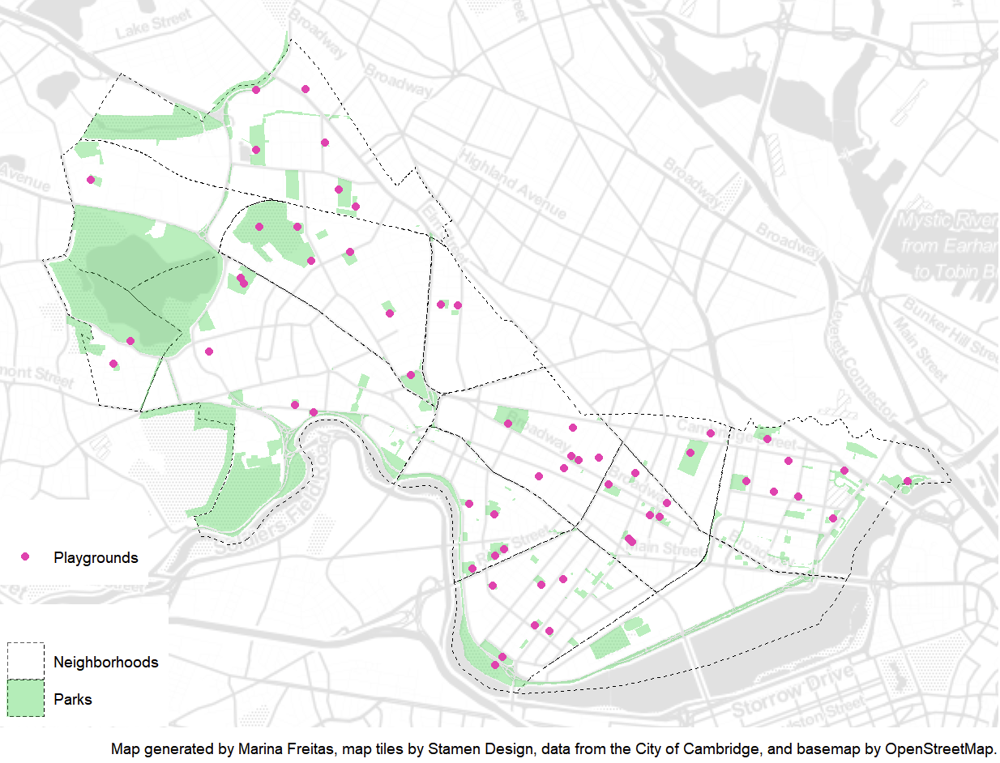
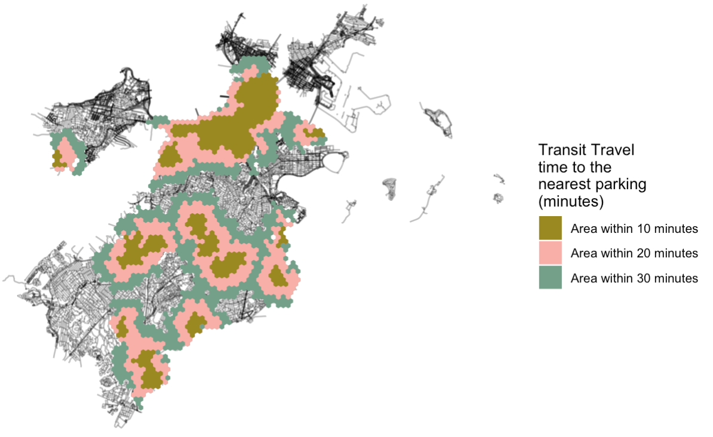
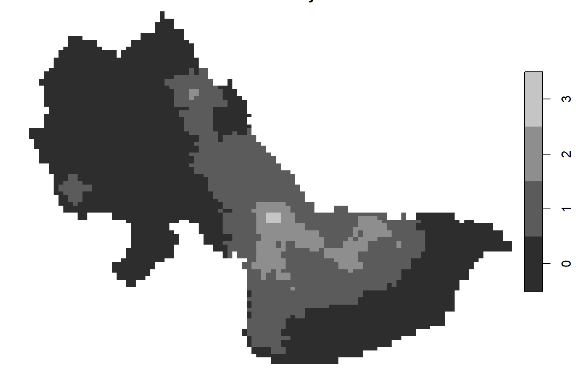
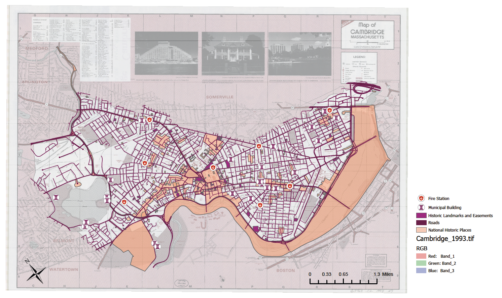
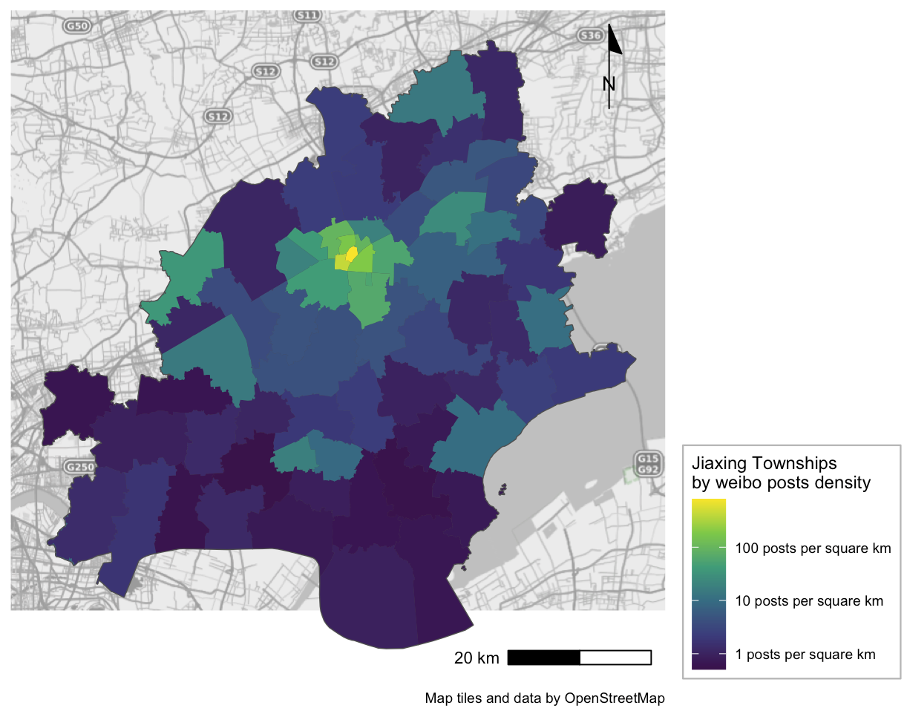
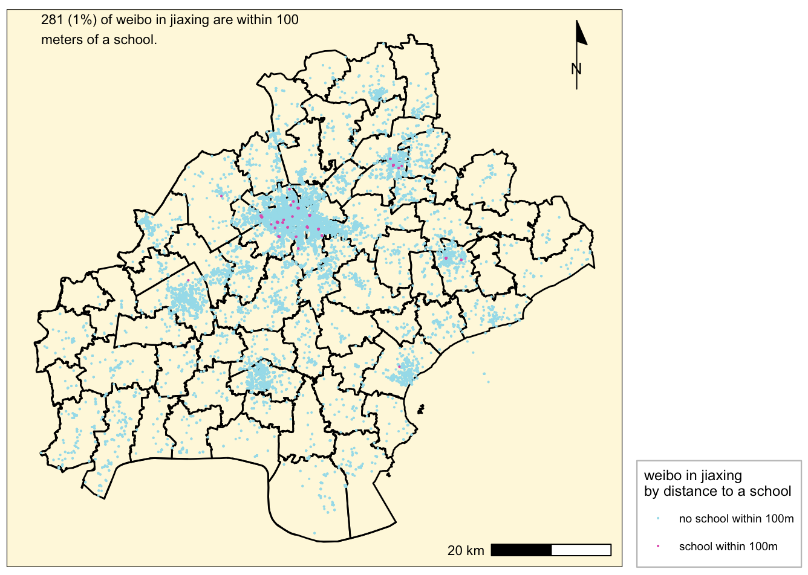
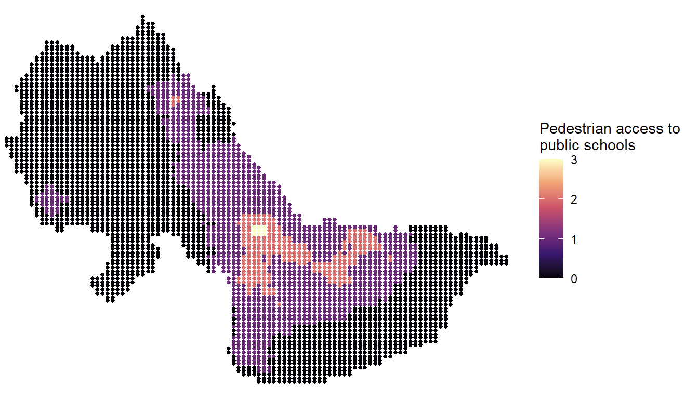
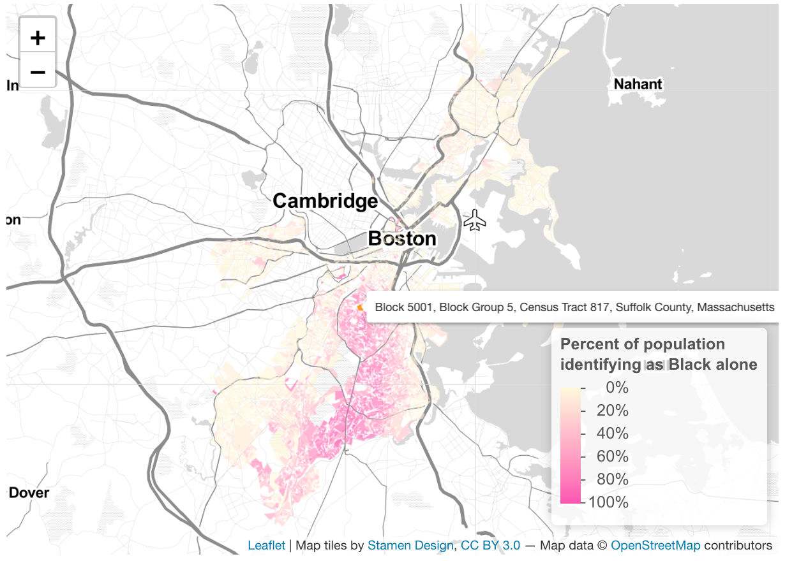

```{r setup, include=FALSE}
knitr::opts_chunk$set(echo = TRUE)
```

## Map 01

Created for Assignment 01 (displaying data), this map demonstrates the following skills: 

* Displaying multiple vector layers on the same map

[](https://github.com/freitasmarina/spatialanalysis_portfolio/blob/main/fullsize/map1.pdf){target="_blank"}

## Map 02
Created for Assignment 04 (routes and networks), this map demonstrates the following skills: 

* Displaying multiple vector layers on the same map
* Calculating and displaying accessibility, based on travel time

[](https://github.com/freitasmarina/spatialanalysis_portfolio/blob/main/fullsize/map2.pdf){target="_blank"}

## Map 03
Created for Assignment 05 (raster data), this map demonstrates the following skills: 

* Calculating and displaying accessibility, based on travel time
* Displaying raster data on a map

[](https://github.com/freitasmarina/spatialanalysis_portfolio/blob/main/fullsize/map3.pdf){target="_blank"}

## Map 04
Created for Assignment 02 (visualizing places), this map demonstrates the following skills: 

* Displaying multiple vector layers on the same map
* Georeferencing a raster image

[](https://github.com/freitasmarina/spatialanalysis_portfolio/blob/main/fullsize/map4.pdf){target="_blank"}

## Map 05
Created for Assignment 03 (spatial relationships), this map demonstrates the following skills: 

* Aggregating point data to a layer of polygons 

[](https://github.com/freitasmarina/spatialanalysis_portfolio/blob/main/fullsize/map5.pdf){target="_blank"}

## Map 06
Created for Assignment 03 (spatial relationships), this map demonstrates the following skills: 

* Displaying multiple vector layers on the same map
* Aggregating point data to a layer of polygons 
* Calculating and displaying relationships among point and polygon layers based on distance

[](https://github.com/freitasmarina/spatialanalysis_portfolio/blob/main/fullsize/map6.pdf){target="_blank"}

## Map 07
Created for Assignment 05 (raster data), this map demonstrates the following skills: 

* Converting between raster layers and vector layers

[](https://github.com/freitasmarina/spatialanalysis_portfolio/blob/main/fullsize/map7.pdf){target="_blank"}

## Map 08

Created for Assignment 06 (interactive map), this map demonstrates the following skills: 

* Displaying data on an interactive map

[]

